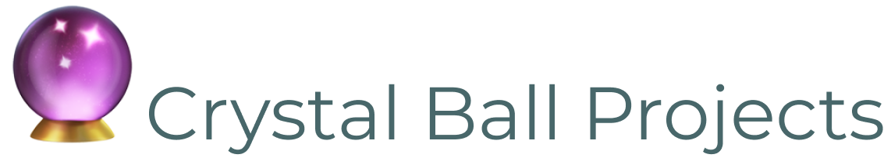

<h1 align="right">
  
</h1>

<!-- prettier-ignore-start -->
  <!--  -->
  
  <!--  -->
  
  
  
  <code>:status&nbsp;&nbsp;&nbsp;&nbsp;&nbsp;&nbsp;</code>

   
  
  
  
  <!--  -->
  <!--  -->
  <code>:integrations</code>

   
  
  
  <code>:flair&nbsp;&nbsp;&nbsp;&nbsp;&nbsp;&nbsp;&nbsp;</code>
<!-- prettier-ignore-end -->

<h1></h1>
 
  

    <em>Documentation and standards for managing Crystal Ball Projects 🔮✨</em>
  

## Prototypes

- [`react-application-prototype`][]
- [`node-service-prototype`][]

## Packages

- [`componentry`][]
- [`cssup`][]
- [`svg-symbol-sprite-loader`][]

## Base packages

- [`commitizen-base`][]
- [`eslint-config-eloquence`][]
- [`prettier-base`][]
- [`semantic-release-base`][]
- [`webpack-base`][]

<!-- Links -->

<!-- prettier-ignore-start -->
[`commitizen-base`]:https://github.com/crystal-ball/commit-base
[`componentry`]:https://github.com/crystal-ball/componentry
[`cssup`]:https://github.com/crystal-ball/cssup
[`eslint-config-eloquence`]:https://github.com/crystal-ball/eslint-config-eloquence
[`node-service-prototype`]:https://github.com/crystal-ball/node-service-prototype
[`prettier-base`]:https://github.com/crystal-ball/prettier-base
[`react-application-prototype`]:https://github.com/crystal-ball/react-application-prototype
[`semantic-release-base`]:https://github.com/crystal-ball/semantic-release-base
[`svg-symbol-sprite-loader`]:https://github.com/crystal-ball/svg-symbol-sprite-loader
[`webpack-base`]:https://github.com/crystal-ball/webpack-base
[commitizen]:https://commitizen.github.io/cz-cli/
<!-- prettier-ignore-end -->
